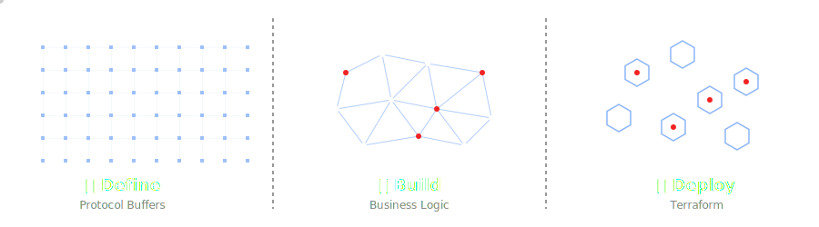

<p align="center">
  
</p>
<p align="center">
  <strong>Shared contracts, upstream where needed, first-party where it matters.</strong>
</p>

# common-protos

Shared Protocol Buffers definitions used by Alis Build, plus a small set of
vendored upstream proto dependencies that our APIs import directly.

## Protocol Buffers in the Define, Build & Deploy framework

<p align="center">
  
</p>

Within the Alis Build platform, Protocol Buffers sit at the heart of the
Define, Build & Deploy (`DBD`) framework. They are the contract that turns an
idea into a shared system boundary before business logic is written or
infrastructure is provisioned.

In `Define`, protobuf schemas force clarity around domain objects, request and
response shapes, service methods, and the flow of state through a system. That
upfront precision keeps innovation grounded in a durable contract instead of
letting interfaces drift as implementation pressure mounts.

In `Build`, those same definitions reduce startup friction. Teams can generate
client and server code, align across services, and build against stable
interfaces without re-negotiating data structures in every codebase.

In `Deploy`, protobuf contracts help keep runtime integrations predictable.
When services, events, and supporting infrastructure are all shaped around the
same schema-first model, deployment becomes safer, easier to automate, and more
consistent across environments.

This repository exists to support that lifecycle: define the contract once,
build from it confidently, and deploy with fewer surprises.

## At a Glance

This repository now has three distinct roles:

| Namespace | Ownership        | Purpose                                       |
| --------- | ---------------- | --------------------------------------------- |
| `alis/`   | Alis Build       | First-party shared APIs and extensions        |
| `google/` | Google           | Vendored Google API and common support protos |
| `lf/`     | Linux Foundation | Vendored Agent2Agent protocol definitions     |

The important distinction is that not every proto in this repository is
authored here. Some packages are maintained upstream and mirrored locally so
that code generation and dependency resolution stay simple and reproducible.

## What Lives Here

### First-party protos

These are the packages that belong to Alis Build and should evolve here:

- `alis/a2a/...`
- `alis/open/...`
- `common/...`

### Vendored upstream protos

These are included because our first-party APIs import them:

- `google/`: Google API annotations, common types, IAM, RPC, logging, and long
  running operations protos commonly used across Cloud-style APIs
- `lf/`: Linux Foundation Agent2Agent (`A2A`) protocol definitions used as the
  baseline contract for agent interoperability

## Current Example

One of the main first-party packages in the repo is:

```text
alis/a2a/extension/history/v1/history.proto
```

That package builds on both first-party and vendored definitions, including
imports from `lf/a2a/v1` and `google/api`.

## Working Model

Treat the repository root as the `protoc` include root:

```bash
protoc -I . \
  --go_out=. \
  --go-grpc_out=. \
  alis/a2a/extension/history/v1/history.proto
```

If a proto imports:

- `google/api/...`, resolve it from this repo's `google/` tree
- `lf/a2a/v1/...`, resolve it from this repo's `lf/` tree
- `alis/...`, resolve it from this repo's first-party packages

## Contribution Rules

Change the namespace you own:

- Update `alis/` and other first-party packages here as part of normal API work.
- Treat `google/` and `lf/` as vendored upstream sources unless there is a very
  deliberate reason to patch them locally.
- If an upstream dependency is refreshed, keep the README for that namespace in
  sync with the source and intent of the imported package set.

## Compatibility

For first-party packages in this repo:

- prefer additive changes
- avoid reusing field numbers
- version packages when making breaking changes
- document deprecations before removal

For vendored upstream packages:

- preserve upstream package names and import paths
- avoid local edits that drift from the upstream source unnecessarily
